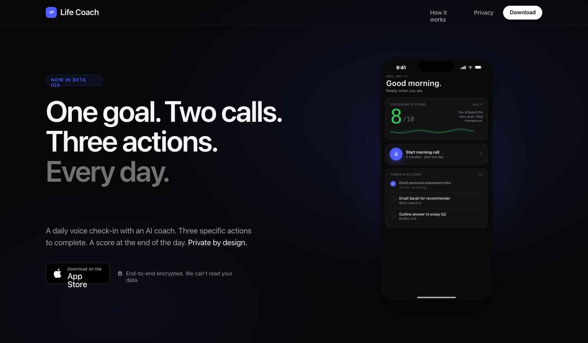
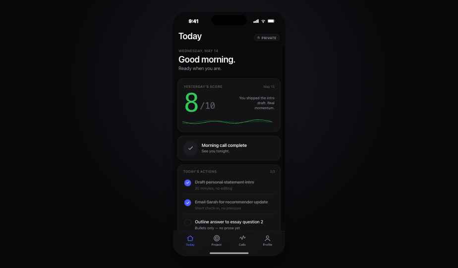
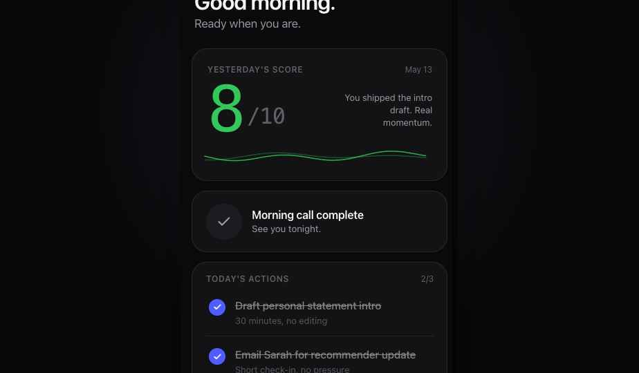

# Life Coach

**One goal. Two calls. Three actions. Every day.**

An AI-powered iOS life coaching app that holds you accountable through daily voice check-ins, three specific micro-actions, and a nightly score — with end-to-end encryption so your data stays private by design.



---

## What it does

Most self-improvement apps drown you in features. Life Coach does the opposite: you pick **one goal**, and the app structures your entire day around making progress on it.

Every morning, your AI coach calls you (5–10 minutes). You talk through what's on your plate, and together you land on **three specific micro-actions** for the day — small, concrete, completable. At the end of the day, your coach calls again. You report what you did. It gives you a **score from 0 to 10** and helps you plan tomorrow.

That's the whole loop. Repeat daily until the goal is done.



---

## Key Features

### 🎙 Daily Voice Check-ins
Two structured 5–10 minute calls per day with your AI coach:
- **Morning call** — reviews your project context, recent progress, and yesterday's outcome. Helps you identify three specific micro-actions for today.
- **Evening call** — you report back on what you completed. The AI scores your day 0–10 with a brief rationale and helps you plan tomorrow.

### ✅ Three Micro-Actions Per Day
Each morning call produces exactly three checkable tasks. They're specific, achievable, and tied to your one active project. Check them off throughout the day from the Home tab.

### 📊 Daily Score + Streak
At the end of every evening call, the AI scores your day 0–10. Your rolling average score and current streak are front and center on the Home dashboard.



### 💬 Text Chat with Your Coach
Message your coach anytime between calls. The AI has full context: your goal, recent micro-actions, past check-in history. Free tier includes 10 messages/day; Premium is unlimited.

### 🔒 End-to-End Encrypted
All your conversations, goals, and progress are encrypted with **AES-256-GCM** before being stored in Firebase. Your encryption key lives on our proxy server — not in the database. We store ciphertext, not your words.

> *"We can't read your data. Not because we choose not to — because the encryption makes it technically impossible."*

### 🎯 One Project at a Time
You focus on one meaningful goal: starting a business, getting fit, finding a relationship, learning a skill, landing a job. The constraint is the feature — split focus is why goals fail.

### 💳 Subscriptions
- **Free** — 10 text messages/day, no voice calls
- **Premium ($19.99/mo or $149.99/yr)** — unlimited chat + 60 voice minutes/week
- **Voice credit packs** — buy extra minutes à la carte

---

## Use Cases

**🚀 Starting a Business**
> Each morning your coach asks what you shipped yesterday, then helps you identify the three most important actions for today. Not a 40-item to-do list. Three things. At night you report back and get an honest score. Over weeks, small daily wins compound into real progress.

**💪 Getting Fit**
> Goal: "Get in the best shape of my life." Daily actions become: "30-minute run before work", "track calories at dinner", "sleep before midnight." The evening check-in asks what you actually did — no judgment, just accountability.

**💼 Landing a New Job**
> Daily micro-actions: "Send 3 cold emails", "update your LinkedIn headline", "practice one interview answer." The coach tracks your streak, spots when you're slipping, and recalibrates when you're stuck.

**📚 Learning a Skill**
> You want to learn Spanish in 6 months. Daily practice actions, progress check-ins, and a coach that reminds you why you started when motivation dips.

**❤️ Relationships**
> You want to be more social. Your coach turns vague intentions into specific actions: "Message two people I haven't talked to in a month", "say yes to the next invite I want to decline."

---

## How It Works

```
Morning ──► Voice check-in (5–10 min)
             │
             ├─ AI reviews your goal + last 7 days
             ├─ Asks how you're feeling
             └─ Generates 3 micro-actions for today
                      │
                      ▼
         [ ] Draft the landing page copy
         [ ] Send cold email to 3 designers
         [x] Post one piece of content
                      │
                      ▼
Evening ──► Voice check-in (5–10 min)
             │
             ├─ Reviews each micro-action
             ├─ Celebrates wins, acknowledges misses without judgment
             ├─ Helps plan tomorrow's 3 actions
             └─ Scores your day: 7/10
```

---

## Tech Stack

| Layer | Technology |
|-------|-----------|
| iOS App | Swift 5.9+, SwiftUI, iOS 17+ |
| Auth | Firebase Auth — Apple Sign-In + Google |
| Database | Firebase Firestore (AES-256-GCM encrypted ciphertext only) |
| Proxy Server | Node.js / Express / TypeScript |
| Key Store | Postgres — per-user encryption keys, master key in env |
| Voice AI | [VAPI](https://vapi.ai) — structured voice calls with JSON output |
| Text AI | [Together AI](https://together.ai) — Llama-3.3-70B-Instruct-Turbo |
| Subscriptions | [RevenueCat](https://revenuecat.com) |
| Push Notifications | Firebase Cloud Messaging |

---

## Project Structure

```
life-coach/
├── LiveCoach/              iOS app (Swift/SwiftUI)
│   ├── App/                Entry point, AppState, RootView
│   ├── Features/
│   │   ├── Home/           Dashboard, score, micro-actions
│   │   ├── Project/        Goal + daily history
│   │   ├── Calls/          Voice + text conversations
│   │   ├── Profile/        Settings, subscription, account
│   │   └── Onboarding/     5-screen onboarding flow
│   ├── Services/           Auth, Chat, Voice, Subscription, Notifications
│   ├── Network/            ProxyAPIClient (all data I/O)
│   └── Models/             Codable data structs
├── proxy/                  Node.js proxy server
│   └── src/
│       ├── routes/         /project, /sessions, /chat, /vapi, /webhooks, /user
│       └── services/       Encryption, key store, Firebase admin, Together AI, VAPI
├── docs/
│   ├── PRD.md              Full product requirements
│   └── architecture.md     System architecture + API specs
└── project.yml             XcodeGen config
```

---

## Setup

### iOS App

```bash
# Install XcodeGen
brew install xcodegen

# Add GoogleService-Info.plist to LiveCoach/
# (download from Firebase console)

# Generate Xcode project
xcodegen generate

# Open and build
open LiveCoach.xcodeproj
```

### Proxy Server

```bash
cd proxy
cp .env.example .env   # fill in your keys
npm install
npm run dev
```

Required environment variables:
```env
FIREBASE_PROJECT_ID=
FIREBASE_SERVICE_ACCOUNT_JSON=    # base64-encoded service account JSON
MASTER_ENCRYPTION_KEY=            # 64 hex chars (32 random bytes)
TOGETHER_AI_API_KEY=
VAPI_API_KEY=
VAPI_ASSISTANT_ID_MORNING=
VAPI_ASSISTANT_ID_EVENING=
VAPI_ASSISTANT_ID_FREE=
VAPI_WEBHOOK_SECRET=
REVENUECAT_WEBHOOK_SECRET=
DATABASE_URL=                     # Postgres connection string
PORT=3000
```

---

## Privacy

Life Coach is **private by design**. Every piece of user content — your goal, your conversations, your micro-actions — is encrypted with AES-256-GCM before it touches Firebase. Encryption keys are stored separately on the proxy server, protected by a master key that only exists in the deployment environment. The AI receives your data only for the duration of an API request and never logs or retains it. Your data is never used to train models.

We designed the system so that even we can't read it.

---

## License

MIT
